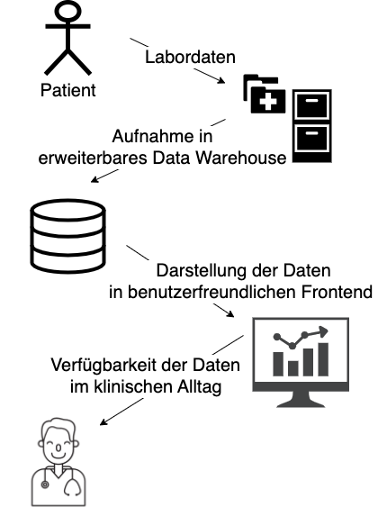
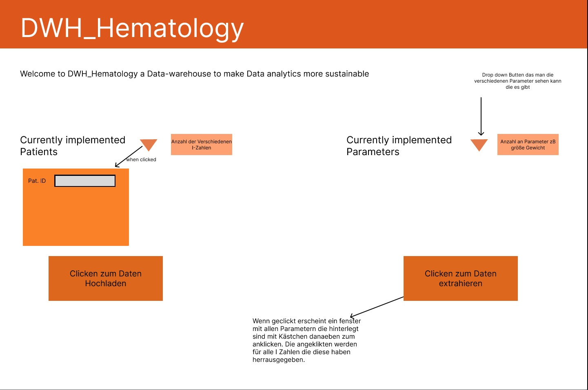

# Willkommen bei DWH_HEMATOLOGY

DWH_HEMATOLOGY ist ein ambitioniertes Projekt, das darauf abzielt, die Datenanalyse in der Hämatologie, Hämostaseologie, Onkologie und Stammzelltransplantation zu verbessern. Unser Fokus liegt auf der Entwicklung eines benutzerfreundlichen Datawarehouses, das ohne Programmierkenntnisse die einfache Handhabung und Analyse medizinischer Daten ermöglicht.

#### Unser Engagement für Exzellenz:

 - Unser Team strebt danach, eine wegweisende Lösung zu schaffen, die neue Maßstäbe setzt. Wir sind motiviert, engagiert und arbeiten intensiv daran, die Grenzen der medizinischen Datenanalyse zu erweitern.

#### Unsere interne Motivation:

 - In unserem Team vereinen wir unsere Talente und unsere Leidenschaft für Innovation. Wir sind fest entschlossen, uns gegenseitig zu motivieren und das Beste aus unseren Fähigkeiten herauszuholen, um dieses Projekt zu einem Erfolg zu machen.

#### Gemeinsam die Zukunft gestalten:

 - Wir dokumentieren unsere Fortschritte, um transparent und zugänglich zu bleiben. Innerhalb unseres Teams schaffen wir eine Umgebung, die unsere gemeinsame Vision für die Zukunft der medizinischen Datenanalyse unterstützt. Deine Unterstützung, Ideen und Expertise sind uns wertvoll, um dieses Ziel zu erreichen und das Projekt voranzutreiben.


## Themenübersicht


* [Projektinhalt und Ziele](https://github.com/health-io/2023-6a/tree/5157ee6f25184b2d91f290500488a6b2ca0390eb/docs/Projektinhalt_und_Ziele)

* [Anleitungen zur Software-Installation](https://github.com/health-io/2023-6a/tree/9c79a6af5a9fabc4aaf10ef3a0c54d7f1fd62d57/docs/software_installation)
  
* Pilotprojekt mittels Testdatensatz

    --> https://github.com/health-io/2023-6a/tree/babded000d2b04a2f73a27b6adae0a66c1fafae8/PILOTPROJEKT_MITTELS_TESTDATENSATZ


## Projektmanagement

Die aktuellen To Dos sind in dem Reiter Issues zu finden:
 -  (https://github.com/health-io/2023-6a/issues)


### Rolleneinteilung
* Beutel Gernot (MHH): Projekt Inhaber
* Geerits Eline: Projekt Maneger
* Mohammad Muneeb: Entwickler
* Lelke Thies: Entwickler
* Lösekrug Julia: Anforderungsmanegment
* Weßel Patricia: Anforderungsmanegment
* Kirstein Janka: Dokumentationsmanegmet
* Daecke Niklas: Dokumentationsmanegmet
* Wiechers Lara (MHH):


## Übersicht über Grundidee

Für ein einfaches Verständnis über die Idee/Ziele dieses Projekts sind hier die Userstory und eine erste Idee eines möglichen Frontend für eine einfache Nutzung des DWH dargestellt. 

### Userstory

Durch das Projekt soll es möglich sein, alle zu einem Patienten gesammelten Daten zusammenzufügen und gemeinsam zu speichern. 
Benötigt ein Arzt zu einem späteren Zeitpunkt die Daten oder auch nur einen Teil davon, kann er sich diese über ein intuitiv zu bedienenen Frondend ausgeben lassen. 



### Frontend

Eine Idee für ein Frondend für die intuitive Nutzung ist hier dargestellt. Inwieweit dies umgesetzt werden kann muss im laufe des Projekts geklärt werden.



## Setup

### Prerequisites

Make sure Node.js and npm are installed and configured correctly. 

Get your elasticsearch node running by following the instructions in the [elasticsearch setup tutorial](https://github.com/health-io/2023-6a/blob/f4e09bb266f90e8198dc85516c62dc5e8b1930d1/docs/software_installation/elasticsearch/es_kib_installation_for_dummies.md). 

Make sure you have the data from the sample data file present in the ```bulk.json``` file imported into elasticsearch(/opensearch). You will find the file in the ```simple_search_interface``` branch's root directory. You can bulk import data into elasticsearch using: 

```
curl.exe -X PUT "localhost:9200/productdata/_bulk?pretty" -H 'Content-Type: application/x-ndjson' --data-binary "@[...path to sample_data_set...]\bulk.json"
```
### Starting the app

Clone the repository onto your machine. Open the repository in VS Code, then open a terminal and run ```npm install``` to update the dependencies. Then run ```npm run dev```. Make sure the working directory is ```"~\2023-6a"```

You should now see the search interface on port 3000 and be able to interact with it. In case of missing modules, manually install the modules mentioned in the error message using ```npm install```

### Developer notes

#### Upload data from excel sheet to elasticsearch

In the web app, upload the file ```example_medical.xlsx``` present in the ```sample_datasets``` folder. The data will be uploaded to a temporary index called ```temp_index```. Take note that any data that was already present on this index will be overwritten. The functionality on empty fields/values has not been tested.

To easily view the data in the index, download the tool called ```elasticvue``` (or add the browser extension) from https://elasticvue.com/ and navigate to ```indices``` and click on ```temp_index```. If you successfully managed to upload the file to your elastic node, you will see the sample patient data.
