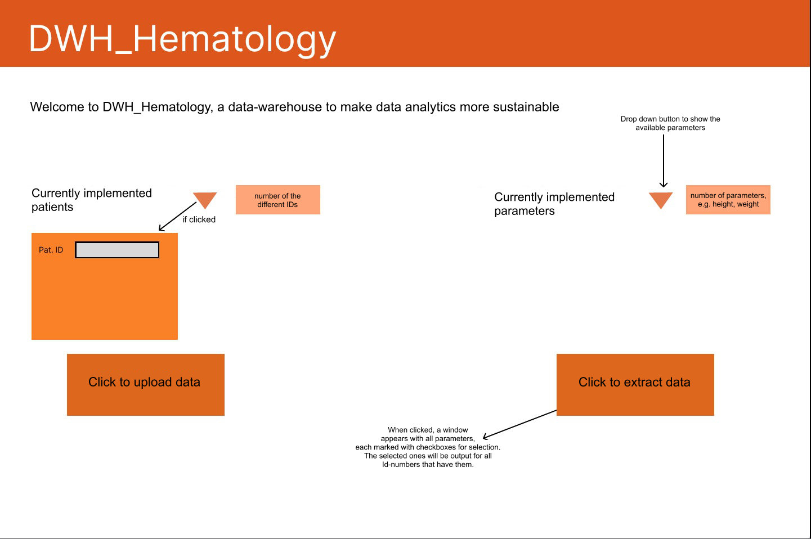

# Welcome to DWH_HEMATOLOGY

DWH_HEMATOLOGY is an ambitious project aimed at improving data analysis in hematology, hemostaseology, oncology, and stem cell transplantation. Our focus is on developing a user-friendly data warehouse that allows for easy handling and analysis of medical data without the need for programming skills.

#### Our commitment to excellence:

 - Our team strives to create a pioneering solution that sets new standards. We are motivated, dedicated, and work intensively to push the boundaries of medical data analysis.

#### Our internal motivation:

 - In our team, we bring together our talents and our passion for innovation. We are firmly committed to motivating each other and bringing out the best in our abilities to make this project a success.

#### Shaping the Future Together:

 - We document our progress to remain transparent and accessible. Within our team, we create an environment that supports our shared vision for the future of medical data analysis. Your support, ideas, and expertise are valuable to us in achieving this goal and advancing the project.


## Topics


* [Projektinhalt und Ziele](https://github.com/health-io/2023-6a/tree/5157ee6f25184b2d91f290500488a6b2ca0390eb/docs/Projektinhalt_und_Ziele)

* [Anleitungen zur Software-Installation](https://github.com/health-io/2023-6a/tree/9c79a6af5a9fabc4aaf10ef3a0c54d7f1fd62d57/docs/software_installation)
  
* Pilotprojekt mittels Testdatensatz


## Projektmanagement

The current 'To Dos' can be found in the [Issues](https://github.com/health-io/2023-6a/issues) tab.
 


### Assignment of Roles
* Beutel Gernot (MHH): Project Owner
* Geerits Eline: Project Manager
* Mohammad Muneeb: Developer
* Weßel Patricia: Developer
* Lelke Thies: Developer
* Lösekrug Julia: Requirements Management
* Kirstein Janka: Documentation Management
* Daecke Niklas: Documentation Management
* Wiechers Lara (MHH)


## Basic Idea

For a simple understanding of the idea/goals of this project, here are the requirements, user story and an initial concept of a possible frontend for easy use of the data warehouse (DWH).

### Requirements

- Patient data should be collected
- each patient has an ID and data is assigned to it
- If data is added later, it should expand the existing data
- The data warehouse originally consists of fixed attributes/columns, but must be automatically expanded when new data is added 
- Data can be numerical values (e.g. blood count) but can also consist of words/texts and pictures
- It should later be possible for a doctor to use the desired data intuitively 
- Selection of various attributes and output of all patient data containing data for these attributes
- Search for an individual patient and output the associated data 
- The entire project should be open source (ATTENTION: also for commercial use)


#### Modification of the requirements for the project: 
- First of all with elasticsearch, even if commercially not possible 
- Implement basic initial functions and then look later at what can be improved

### Userstory

The project aims to aggregate and store all data collected for a patient. If a doctor needs the data or even just a part of it at a later time, they can retrieve it through an intuitively designed frontend.


### Frontend

An idea for an intuitive frontend is presented here. The extent to which this can be implemented will need to be clarified as the project progresses.



## Setup

### Prerequisites

Make sure Node.js and npm are installed and configured correctly. 

Get your elasticsearch node running by following the instructions in the [elasticsearch setup tutorial](https://github.com/health-io/2023-6a/blob/f4e09bb266f90e8198dc85516c62dc5e8b1930d1/docs/software_installation/elasticsearch/es_kib_installation_for_dummies.md). 

Make sure you have the data from the sample data file present in the ```bulk.json``` file imported into elasticsearch(/opensearch). You will find the file in the ```simple_search_interface``` branch's root directory. You can bulk import data into elasticsearch using: 

```
curl.exe -X PUT "localhost:9200/productdata/_bulk?pretty" -H 'Content-Type: application/x-ndjson' --data-binary "@[...path to sample_data_set...]\bulk.json"
```
### Starting the app

Clone the repository onto your machine. Open the repository in VS Code, then open a terminal and run ```npm install``` to update the dependencies. Then run ```npm run dev```. Make sure the working directory is ```"~\2023-6a"```

You should now see the search interface on port 3000 and be able to interact with it. In case of missing modules, manually install the modules mentioned in the error message using ```npm install```

### Developer notes

#### Upload data from excel sheet to elasticsearch

In the web app, upload the file ```example_medical.xlsx``` present in the ```sample_datasets``` folder. The data will be uploaded to a temporary index called ```temp_index```. Take note that any data that was already present on this index will be overwritten. The functionality on empty fields/values has not been tested.

To easily view the data in the index, download the tool called ```elasticvue``` (or add the browser extension) from https://elasticvue.com/ and navigate to ```indices``` and click on ```temp_index```. If you successfully managed to upload the file to your elastic node, you will see the sample patient data.
